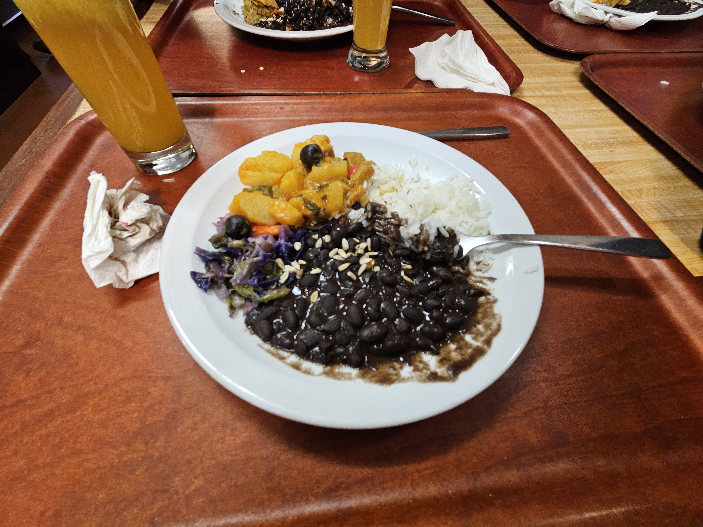

# EUC 2025
## Dag 1
I förberedelse för den tidiga flygresan la jag mig redan klockan fem på eftermiddagen. Detta visade sig vara ett misstag när jag sedan vaknade två på morgonen. Med orimlig pigghet packade jag ihop mina saker och, i brist på tidiga bussar, promenerade till den lokala spårvagnsstationen.

I mitt resemässiga iver förlade jag mitt fotografiarbete längst bak i minnet och avnjöt istället den långa bussresan till flygplatsen tillsammans med resten av laget, Loke och Olle. Joshua var dock frånvarande. Han låg och sov fortfarande. 

Medan vi står och väntar på Joshua på flygplatsen kan jag förklara lite kort om vad EUC är. EUC, det europeiska programmeringsmästerskapet, är den tredje deltävlingen i en serie tävlingar under ICPC-paraplyet. Ett typiskt tävling i ICPC-format består av 5-10 problem och en tidsgräns på 5 timmar, där varje problem går ut på att designa och implementera en algoritm som löser ett visst problem inom en viss tidsgräns. Efter höga placeringar av vårt lag 🥶 i de tidigare tävlingarna NCPC och NWERC missade laget precis kvalifikation till världsmästerskapet ICPC, men landade ändå en plats i det europeiska och en andra chans att gå vidare. 

Resan i sig var händelsefattig, en helt vanlig flygresa med helt vanliga utsikter och helt vanliga flygplansaktiviteter på en helt vanlig dag.

Framme i Porto utnyttjade vi faktum att när fyra människor delar på en Uber blir kostnaden per person lägre än en bussbiljett och tog oss i enlighet med detta till hotellet. Eftersom tävlingsregistrering började klockan 16 och det dåvarande klockslaget bara var 13 bestämde vi för att hitta en lokal restaurang istället. Restaurangen vi hamnade på var _väldigt_ spännande, där det inte fanns någon meny och maten byttes ut hela tiden. För 6 euro tyckte vi dock det var helt värt.

Klockan var fortfarande ett tag bort från början på registreringen så vi tog en promenad runt staden. Nära restaurangen hittade vi en park. I parken hittade vi en liten butik som sålde glass. Vid detta läge var det istället jag som höll på somna. 

Registreringen gick smidigt och en stor hall med företagsutställningar presenterade sig för oss. Tävlingens sponsorer hade tagit med sig pussel och pyssel och roliga företagsmärkta saker för oss att ta hem. Ett företag, Pinely, hade släpat dit en hel kloautomat fylld med små grangosedjur som folk kunde vinna. Denna automat kommer bli väldigt viktig längre fram i berättelsen.

När klockan slog 18 satte vi oss i aulan för öppningsceremonin. Ceremonin bestod till hälften av information om tävlingen och tal från sponsorerna, och till hälften av kulturella event. Den största, anser jag, var universitetets förening för klassisk portugesisk musik. 

Efter detta var jag fullständigt utmattad och gav därmed upp på mitt medvetande.

## Dag 2
På dagens agenda fanns två viktiga uppdrag. Att gå på informationsmötet, och att utforska datorerna på provtävlingen inför den riktiga tävlingen.

Det första uppdraget misslyckades vi med direkt. Olle med irrationell pigghet steg upp tidigt och gick på informationsmötet åt oss, för att våra trötta kroppar skulle få sova i en extra timme. Informationen visade sig dock vara identisk till alla föregående år, och vi hade inte missat något särskilt.

Framme vid universitetet fick vi idén att klistra på klistermärken med lagnamnet på våra namnbrickor.

Provtävlingen började inte förrän efter lunch, vilket lämnade oss något sysslolös i resten av morgonen. Denna tid ägnade vi åt spelen hos företagen på jobbmässan. Två tävlingar tog även plats. Om man kunde gissa hur många tangentbordsknappar fanns i en stor burk kunde man vinna 100 euro, och om man kunde den mest optimala strängen för en programmeringsuppgift fanns 150 euro att vinna i bitcoin. 

På provtävlingen är det primära målet att lära sig alla datorsystemets egenskaper och konstigheter, till hjälp har man fyra testuppgifter att lösa. Att "vinna" provtävlingen har praktiskt sett ingen prestige, men kul är det ändå. 🥶 tog fjärde plats av de 53 deltagande lagen. De fick också Vim bindings tvingade på sig, och explicita anteckningar togs för hur denna funktion stängs av.

Efter den framgångsrika lärorika testtävlingen fortsatte vi roa oss på jobbmässan. Joshua och Olle hade vässat sina klomaskinskunskaper och kunde ganska lätt vinna gosedjur varje omgång. De hade redan vunnit flera små granar och en stor gran var, och de Pinelyanställda hade börjat lägga märke till dem.

Det sista eventet på dagen var en middag på Sheratonhotellet, sponsrat helt av Jane Street. På middagen delade de ut priset för tangentbordsknappstävlingen och lät oss ta med några knappar var som en souvenir. De hade dessutom sina kända t-shirts som man kunde ta. Jag tog den mest kreativa bilden jag kunde.

## Dag 3
Idag ägde tävlingen rum. Stämningen var hyfsat lugn för hur mycket stod på spel. Jämfört med de föregående tävlingarna hade 🥶 spenderat väldigt mycket mer tid på träning, nu _förväntade_ vi ett bra resultat från tävlingen.

Tävlingen gick initialt bra. Laget hade löst två problem första timmen och satt stabilt på plats 15, tillsammans med våra norska kompisar på NTNU precis under. En fördel som fanns i år var att flera av lagen redan var kvalificerade till världsfinalerna och kunde därmed inte ta ifrån oss vår egen kvalificering, vilket medförde att 🥶 kunde titta på vilka uppgifter de bästa lagen hade löst först och lösa dem själva. 

Laget lyckades dock inte hålla den höga inskickningsfrekvensen genom hela tävlingen däremot. Med den växande svårighetsgraden i uppgifter samt den ökande stressen för att lösa dem blev tävlingen mer och mer påfrestande mentalt. Till sist lyckades laget lösa fem uppgifter, och placera sig på 38:e plats av 53. 🥶 kände sig ändå hyfsat nöjd med sin prestation. 

Berättelsen slutar däremot inte här. Den högsta prioriteten nu var ju såklart att vinna ännu fler gosedjur. Tre stora, fem små och några till räcker ju knappast. Dessutom var det bara Joshua och Olle som hade kört, nu skulle jag och Loke tjäna till oss några priser också. Roligt nog hade Olle och Joshua vunnit så pass många priser att de hade blivit förbjudna att köra mer, vilket satte extra mycket press på oss att prestera.

Sedan var det lösningspresentation och därefter middag, och ytterligare försök på klomaskinen efter det. Jag, Joshua och Olle hade redan vunnit varsin stora grangosse, men Loke stod tomhänt ännu. Värre blev det när han hade lyckats dra upp en stor gran och flytta den nästan till prislådan, bara för att klon skulle ge upp precis framför målllinjen. Åter ställde vi oss i kön och tittade ledsamt medan de stora granarna togs upp en efter en. 

När vi stod längst fram igen hade Loke en stor utmaning. Den enda granen som fanns kvar låg snett på sidan, i en vinkel nästan omöjlig att greppa normalt. Men Loke är ju smart. Han kan innovera. Han såg att granen låg mot väggen, han kan fysikens lagar. Han _slår till_ sidan av maskinen, granen flyger till mitten och låter sig bli plockad ut ur maskinen som om granen själv ville bli vunnen av Loke. Publiken som vi hade samlat runt oss firade. Programmeringstävlingen hade ingen betydelse längre, detta var dagens höjdpunkt.

Andra hade däremot andra höjdpunkter. För varje uppgift ett lag löser under tävlingen blir de tilldelad en ballong. Dessa ballonger får de ha kvar efter tävlingen. Några av lagen hade lämnat kvar sina ballonger i stora hallen, och vi insåg att vi kunde utnyttja fysikens lagar på ytterligare ett sätt. Joshua kom på idén att knyta ihop några ballonger och fästa en pappersmugg till ballongerna, och nådde på så sätt jämvikt. Att koppen svävade genom luften horisontellt utan att åka uppåt eller neråt var helt fascinerade.

Jag kom senare på idén att knyta en av de små gosedjuren till ballongerna och mitt experiment lyckades.

Med dessa resultat var vi fullständigt nöjda för dagen, och tog oss tillbaka till hotellet för välförtjänd sömn.
